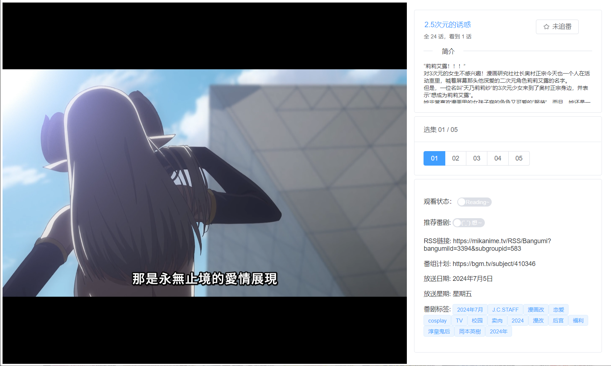

# JAnime桌面端

## 简介
为JAnime提供pc客户端播放器，内嵌mpv播放器，对一些特殊格式的资源（如内封字幕）可以直接播放观看

## 更新日志
☞ [release-note](release-note.md)

## 安装构建
1. 下载[mpvjs.node](https://github.com/Kagami/mpv.js/releases)
2. 下载mpv-1.dll，这个来自libmpv
3. 将两个文件分别放到目录：build/extraResources/dll/mpvjs
4. 打包前端项目，将dist拖到public目录
5. 打包命令（根目录package.json）：encrypt->build-wz

## 截图演示
<table>
    <tr>
        <td></td>
        <td></td>
        <td></td>
    </tr>
</table>

## 核心依赖
- Electron：Electron是一个使用 JavaScript、HTML 和 CSS 构建桌面应用程序的框架
- electron-egg：一个入门简单、跨平台、企业级桌面软件开发框架。
- mpv：是一款强大的播放器（Command line video player）
- mpv.js：将mvp播放器内嵌到Electron（虽然作者很久没维护了）
- vue3：渐进式JavaScript框架
- element-plus：很流行的vue3 UI组件库
- vite：前端项目构建工具（速度飞快）
